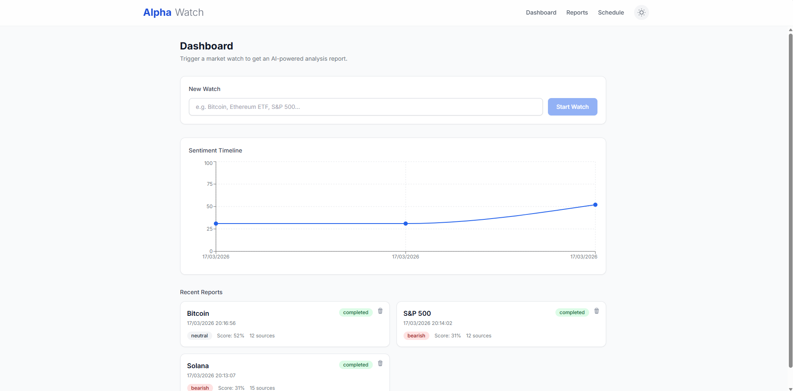
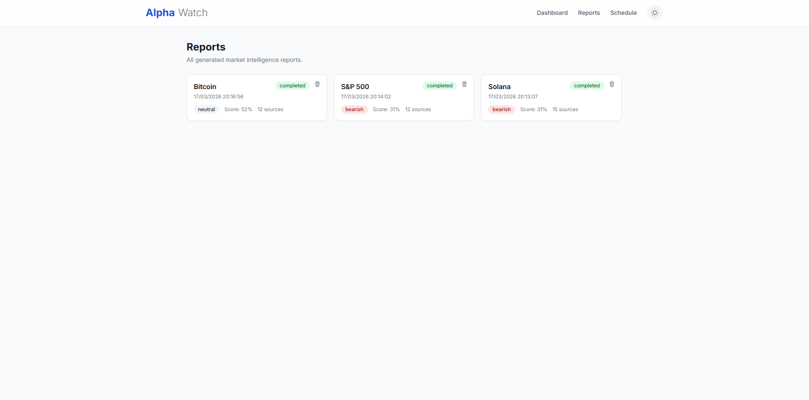
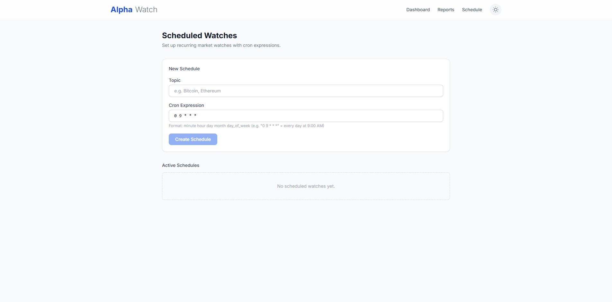
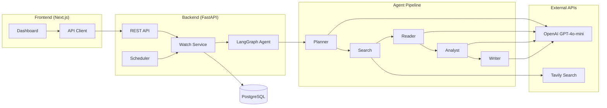

# AlphaWatch

**AI-powered autonomous financial market intelligence agent.**

AlphaWatch monitors crypto and financial markets, generating comprehensive analysis reports using an AI agent pipeline. It works out of the box in **mock mode** — no API keys needed to demo the full pipeline.


## Screenshots

| Dashboard | Reports | Schedule |
|:-:|:-:|:-:|
|  |  |  |

---

## Architecture



### Agent Pipeline

| Node | Role |
|------|------|
| **Planner** | Decomposes the topic into 3-5 targeted research sub-questions |
| **Search** | Queries Tavily Search API for each sub-question |
| **Reader** | Filters and summarizes the most relevant articles |
| **Analyst** | Determines sentiment (bullish/bearish/neutral) and extracts key facts |
| **Writer** | Generates a comprehensive Markdown report |

---

## Quick Start

### Prerequisites

- Docker & Docker Compose
- Node.js 18+ (for frontend)
- Python 3.12+ (for local backend dev)

### 1. Clone & Setup

```bash
git clone https://github.com/Xyness/AlphaWatch.git
cd AlphaWatch
cp .env.example .env
```

### 2. Start PostgreSQL

```bash
docker compose up -d postgres
```

### 3. Run the Backend

```bash
cd backend
python -m venv .venv && source .venv/bin/activate
pip install -r requirements.txt
uvicorn app.main:app --reload
```

The backend starts in **mock mode** if no API keys are set (you'll see a warning in the logs).

### 4. Run the Frontend

```bash
cd frontend
npm install
npm run dev
```

Open [http://localhost:3000](http://localhost:3000) and trigger your first watch!

### Run Everything with Docker

```bash
docker compose up -d
```

---

## API Reference

| Method | Endpoint | Description |
|--------|----------|-------------|
| `POST` | `/watch` | Trigger a new market watch (`{"topic": "Bitcoin"}`) |
| `GET` | `/reports` | List all reports |
| `GET` | `/reports/{id}` | Get a specific report |
| `POST` | `/schedule` | Create a scheduled watch (`{"topic": "ETH", "cron_expression": "0 9 * * *"}`) |
| `GET` | `/schedule` | List all schedules |
| `DELETE` | `/schedule/{id}` | Delete a schedule |
| `GET` | `/health` | Health check + mock mode status |

### Example

```bash
# Trigger a watch
curl -X POST http://localhost:8000/watch \
  -H 'Content-Type: application/json' \
  -d '{"topic": "Bitcoin"}'

# Check the report
curl http://localhost:8000/reports
```

---

## Mock Mode

When `OPENAI_API_KEY` or `TAVILY_API_KEY` are empty, AlphaWatch runs in **mock mode**:

- The full agent pipeline executes normally
- LLM calls return realistic simulated financial analysis
- Search calls return template market articles
- Reports are generated with proper Markdown formatting
- Perfect for demos, development, and testing

To use real APIs, add your keys to `.env`:

```
OPENAI_API_KEY=sk-...
TAVILY_API_KEY=tvly-...
```

---

## Tech Stack

| Layer | Technology |
|-------|-----------|
| Agent | LangGraph + LangChain |
| LLM | OpenAI GPT-4o-mini (or mock) |
| Search | Tavily API (or mock) |
| Backend | FastAPI + SQLAlchemy (async) |
| Database | PostgreSQL 16 |
| Scheduler | APScheduler |
| Frontend | Next.js 14 + Tailwind CSS |
| Charts | Recharts |
| Infra | Docker Compose |

---

## Project Structure

```
AlphaWatch/
├── backend/
│   ├── app/
│   │   ├── main.py              # FastAPI entrypoint
│   │   ├── config.py            # Settings + mock detection
│   │   ├── api/                 # REST endpoints
│   │   ├── models/              # ORM + Pydantic schemas
│   │   ├── db/                  # Async session + init
│   │   ├── agent/               # LangGraph pipeline
│   │   │   ├── graph.py         # Graph assembly
│   │   │   ├── mock.py          # Mock LLM + Search
│   │   │   └── nodes/           # Pipeline nodes
│   │   ├── services/            # Business logic
│   │   └── core/                # Client factories
│   ├── requirements.txt
│   └── Dockerfile
├── frontend/
│   └── src/
│       ├── app/                 # Next.js pages
│       ├── components/          # React components
│       ├── hooks/               # Custom hooks
│       └── lib/                 # API client + types
├── docker-compose.yml
└── README.md
```

---

## License

MIT
