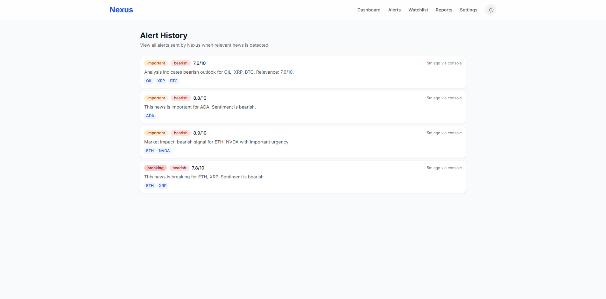
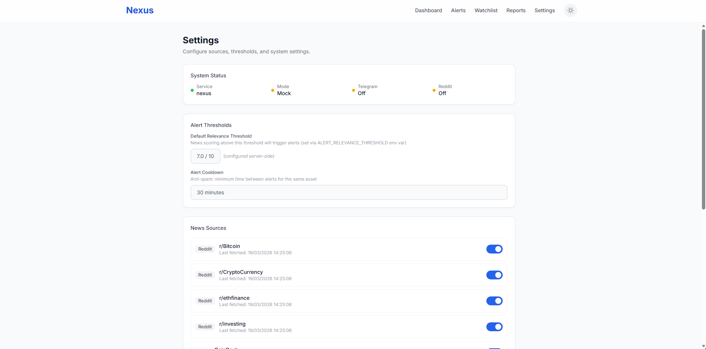
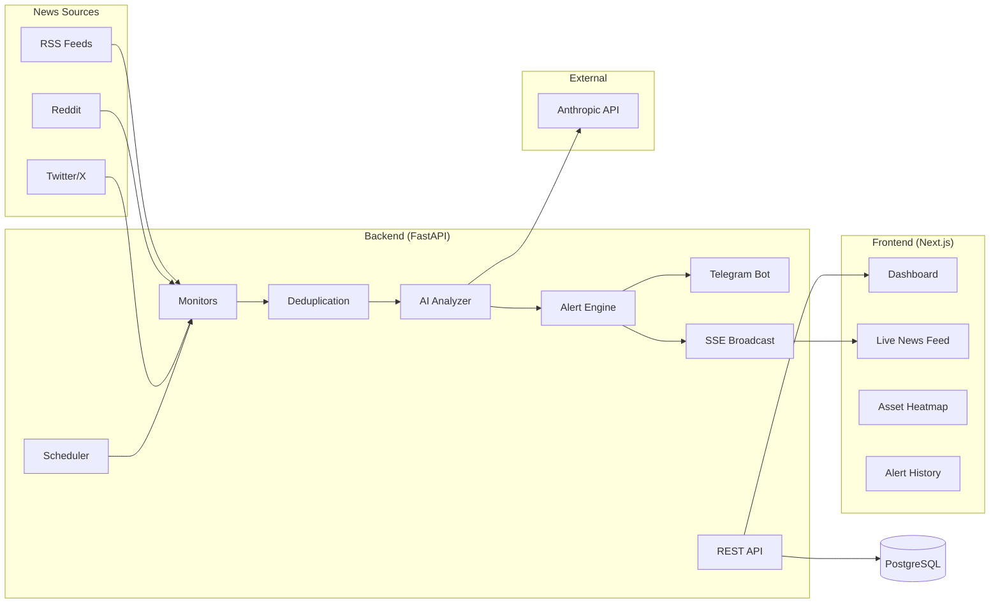

# Nexus

**AI-powered real-time crypto & finance surveillance system.**

Nexus monitors crypto and financial news in real time from RSS feeds, Reddit, and Twitter/X. It analyzes every news item with AI, scores its relevance, and sends Telegram alerts when something important happens. Works out of the box in **mock mode** — no API keys needed.


## Screenshots

| Dashboard | Alerts | Settings |
|:-:|:-:|:-:|
|  |  |  |

---

## Architecture



### Pipeline

| Step | Role |
|------|------|
| **Monitors** | Fetch news from RSS, Reddit, Twitter/X every N minutes |
| **Deduplication** | SHA-256 hash on title+URL prevents duplicate processing |
| **AI Analyzer** | Scores relevance (0-10), detects sentiment, urgency, affected assets |
| **Alert Engine** | Triggers alerts based on thresholds + watchlist + 30min cooldown |
| **Telegram Bot** | Sends formatted alerts with `/status`, `/last10` commands |
| **SSE Broadcast** | Pushes real-time events to the dashboard |

### Legacy Report Pipeline

The original LangGraph agent pipeline (Planner → Search → Reader → Analyst → Writer) is still available via the `/watch` endpoint for on-demand deep-dive reports.

---

## Quick Start

### Prerequisites

- Docker & Docker Compose
- Node.js 18+ (for frontend dev)
- Python 3.12+ (for backend dev)

### 1. Clone & Setup

```bash
git clone https://github.com/Xyness/Nexus.git
cd Nexus
cp .env.example .env
```

### 2. Run Everything with Docker

```bash
docker compose up -d
```

Open [http://localhost:3000](http://localhost:3000) — the dashboard shows live news and alerts immediately in mock mode.

### Local Development

```bash
# Backend
cd backend
python -m venv .venv && source .venv/bin/activate
pip install -r requirements.txt
uvicorn app.main:app --reload

# Frontend
cd frontend
npm install
npm run dev
```

---

## API Reference

| Method | Endpoint | Description |
|--------|----------|-------------|
| `GET` | `/news` | List news items with analyses |
| `GET` | `/news/stream` | SSE stream for real-time updates |
| `GET` | `/news/stats/daily` | Today's statistics |
| `GET` | `/alerts` | Alert history |
| `GET` | `/watchlist` | List watched assets |
| `POST` | `/watchlist` | Add asset (`{"asset_symbol": "BTC", "alert_threshold": 5.0}`) |
| `DELETE` | `/watchlist/{id}` | Remove asset from watchlist |
| `GET` | `/sources` | List all news sources |
| `PATCH` | `/sources/{id}` | Enable/disable a source |
| `POST` | `/watch` | Trigger a deep-dive report (legacy) |
| `GET` | `/reports` | List all reports |
| `GET` | `/reports/{id}` | Get a specific report |
| `POST` | `/schedule` | Create a scheduled report |
| `GET` | `/health` | Health check + system status |

### Example

```bash
# Get recent news
curl http://localhost:8000/news?limit=5

# Add BTC to watchlist (alerts when score >= 5)
curl -X POST http://localhost:8000/watchlist \
  -H 'Content-Type: application/json' \
  -d '{"asset_symbol": "BTC", "alert_threshold": 5.0}'

# Check alerts
curl http://localhost:8000/alerts
```

---

## Mock Mode

When `ANTHROPIC_API_KEY` is empty, Nexus runs in **mock mode**:

- Mock monitors generate realistic crypto/finance news every 10 minutes
- Mock AI analyzer returns structured JSON with realistic score distributions (20% high, 30% medium, 50% noise)
- Mock Telegram bot logs alerts to console instead of sending
- The full pipeline runs end-to-end: fetch → dedup → analyze → alert → SSE → dashboard

To use real APIs, add your keys to `.env`:

```
ANTHROPIC_API_KEY=sk-ant-...
TELEGRAM_BOT_TOKEN=123456:ABC...
TELEGRAM_CHAT_IDS=123456789
```

---

## Configuration

| Variable | Description | Default |
|----------|-------------|---------|
| `ANTHROPIC_API_KEY` | Anthropic API key (empty = mock mode) | |
| `TAVILY_API_KEY` | Tavily Search API key | |
| `TELEGRAM_BOT_TOKEN` | Telegram bot token | |
| `TELEGRAM_CHAT_IDS` | Comma-separated chat IDs | |
| `REDDIT_CLIENT_ID` | Reddit app client ID | |
| `REDDIT_CLIENT_SECRET` | Reddit app secret | |
| `TWITTER_BEARER_TOKEN` | Twitter/X API bearer token | |
| `POLL_INTERVAL_MINUTES` | Monitor polling interval | `10` |
| `ALERT_RELEVANCE_THRESHOLD` | Min score to trigger alert | `7.0` |

---

## Tech Stack

| Layer | Technology |
|-------|-----------|
| AI Analysis | Anthropic API (or mock) |
| Report Agent | LangGraph + LangChain |
| Backend | FastAPI + SQLAlchemy (async) |
| Database | PostgreSQL 16 |
| Scheduler | APScheduler |
| Alerts | python-telegram-bot |
| News Sources | feedparser, PRAW, Tweepy |
| Frontend | Next.js 14 + Tailwind CSS |
| Real-time | Server-Sent Events (SSE) |
| Infra | Docker Compose |

---

## Project Structure

```
Nexus/
├── backend/
│   ├── app/
│   │   ├── main.py              # FastAPI entrypoint + source seeding
│   │   ├── config.py            # Settings + mock detection
│   │   ├── api/                 # REST endpoints (news, alerts, watchlist, sources)
│   │   ├── models/              # ORM models + Pydantic schemas
│   │   ├── db/                  # Async session + init
│   │   ├── agent/               # AI analyzer + LangGraph pipeline
│   │   ├── monitors/            # RSS, Reddit, Twitter monitors + mocks
│   │   ├── alerts/              # Telegram bot + formatting + mock
│   │   ├── services/            # Business logic (analysis, alerts, scheduler)
│   │   └── core/                # LLM client factories
│   ├── tests/                   # pytest test suite
│   ├── requirements.txt
│   └── Dockerfile
├── frontend/
│   └── src/
│       ├── app/                 # Pages (dashboard, alerts, watchlist, settings)
│       ├── components/          # React components
│       ├── hooks/               # useSSE, useAlerts, useWatchlist, usePolling
│       └── lib/                 # API client + types
├── docs/                        # Screenshots
├── docker-compose.yml
└── README.md
```

---

## License

MIT
