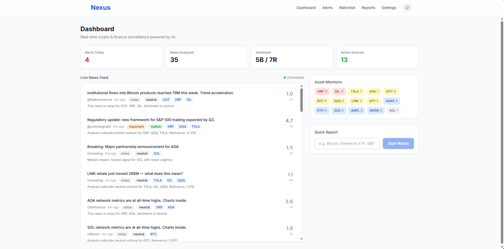
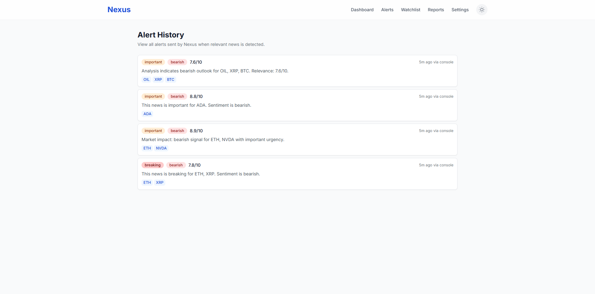
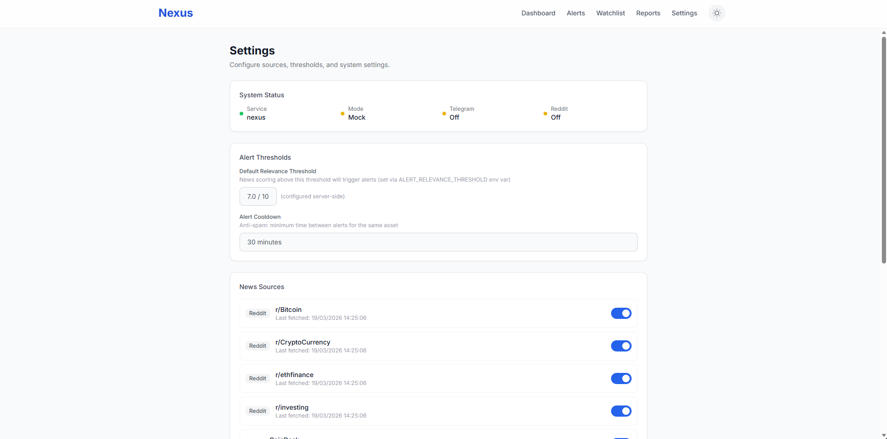
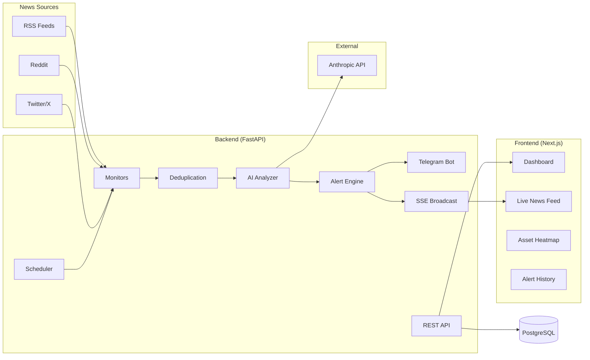

# Nexus

Watches crypto and finance news as it lands, has an LLM read every item, and pings you on
Telegram when something is actually worth knowing about.

[](https://github.com/Xyness/Nexus/actions/workflows/ci.yml)


| Dashboard | Alerts | Settings |
|:-:|:-:|:-:|
|  |  |  |

## Getting it running

```bash
git clone https://github.com/Xyness/Nexus.git
cd Nexus
cp .env.example .env
docker compose up -d
```

Then [localhost:3000](http://localhost:3000). You don't need to fill anything in — with no
`ANTHROPIC_API_KEY` set it starts in mock mode and the dashboard has news flowing through it
within a minute. See [Mock mode](#mock-mode) below, it's the part I'd read first.

For development outside Docker:

```bash
cd backend
python -m venv .venv && source .venv/bin/activate
pip install -r requirements.txt
uvicorn app.main:app --reload

cd frontend
npm install && npm run dev
```

## How it fits together


```mermaid
graph LR
    subgraph Sources ["News Sources"]
        RSS[RSS Feeds]
        RED[Reddit]
        TW[Twitter/X]
    end

    subgraph Backend ["Backend (FastAPI)"]
        MON[Monitors] --> DEDUP[Deduplication]
        DEDUP --> ANAL[AI Analyzer]
        ANAL --> ALERT[Alert Engine]
        ALERT --> TG[Telegram Bot]
        ALERT --> SSE[SSE Broadcast]
        API[REST API]
        SCH[Scheduler]
    end

    subgraph Frontend ["Frontend (Next.js)"]
        DASH[Dashboard]
        FEED[Live News Feed]
        HEAT[Asset Heatmap]
        HIST[Alert History]
    end

    subgraph External ["External"]
        LLM[Anthropic API]
    end

    RSS --> MON
    RED --> MON
    TW --> MON
    ANAL --> LLM
    SSE --> FEED
    API --> DASH
    SCH --> MON
    API --> DB[(PostgreSQL)]
```

Monitors poll each enabled source every ten minutes. Anything new gets hashed on title+URL
and dropped if we've seen it, which matters more than you'd think — the same Reuters story
comes back through four different feeds.

What survives goes to the analyzer, which asks the model for a relevance score out of ten
plus sentiment, urgency and which assets are involved. That call uses the API's structured
output mode, so the response comes back schema-constrained rather than as JSON wrapped in
markdown fences that then needs unwrapping.

Anything scoring above the threshold becomes an alert: Telegram if it's configured, and an
SSE event either way so the dashboard updates without polling. Watchlisted assets use a lower
threshold, and there's a 30-minute cooldown per asset so one busy morning doesn't turn into
forty notifications.

The `/watch` endpoint is a separate, older path: a LangGraph pipeline (planner → search →
reader → analyst → writer) that produces a long-form report on demand. It predates the
streaming side and is kept because it's still the better tool when you want depth on one
topic rather than breadth across the feed.

## Mock mode

If `ANTHROPIC_API_KEY` is empty, every external dependency is swapped for a fake:

- monitors invent plausible crypto/finance headlines instead of fetching
- the analyzer returns generated scores with a realistic spread (roughly 20% high, 30%
  medium, 50% noise) rather than everything clustering at 7
- the Telegram bot logs to stdout

The pipeline itself is untouched — fetch, dedup, analyze, alert, SSE, dashboard all run for
real. This exists because the alternative is either a project nobody can try without a
billing account, or a test suite that costs money to run. `conftest.py` clears the key, so
CI is always in mock mode.

To go live, fill in `.env`:

```
ANTHROPIC_API_KEY=sk-ant-...
TELEGRAM_BOT_TOKEN=123456:ABC...
TELEGRAM_CHAT_IDS=123456789
```

Reddit and Twitter credentials are optional and independent — each source enables itself
when its keys are present, so you can run RSS-only quite happily.

## API

| Method | Endpoint | |
|---|---|---|
| `GET` | `/news` | News with their analyses |
| `GET` | `/news/stream` | SSE stream |
| `GET` | `/news/stats/daily` | Today's numbers |
| `GET` | `/alerts` | Alert history |
| `GET` `POST` `DELETE` | `/watchlist` | Watched assets |
| `GET` `PATCH` | `/sources` | List sources, enable/disable one |
| `POST` | `/watch` | Deep-dive report (LangGraph path) |
| `GET` | `/reports` | Reports, `/reports/{id}` for one |
| `POST` | `/schedule` | Schedule a recurring report |
| `GET` | `/health` | Health and system status |

```bash
curl http://localhost:8000/news?limit=5

curl -X POST http://localhost:8000/watchlist \
  -H 'Content-Type: application/json' \
  -d '{"asset_symbol": "BTC", "alert_threshold": 5.0}'
```

## Configuration

Everything is read from `.env` via pydantic-settings. The two you'll actually want to change:

| Variable | Default | |
|---|---|---|
| `POLL_INTERVAL_MINUTES` | `10` | How often monitors run |
| `ALERT_RELEVANCE_THRESHOLD` | `7.0` | Score needed to fire an alert |

The rest are credentials — `ANTHROPIC_API_KEY`, `TAVILY_API_KEY`, `TELEGRAM_BOT_TOKEN`,
`TELEGRAM_CHAT_IDS`, `REDDIT_CLIENT_ID`, `REDDIT_CLIENT_SECRET`, `TWITTER_BEARER_TOKEN` —
plus `DATABASE_URL`. All of them default to empty or to the docker-compose values.

## Stack

FastAPI with async SQLAlchemy over PostgreSQL 16, APScheduler for the polling loop,
python-telegram-bot for delivery, feedparser/PRAW/Tweepy for the sources. The report pipeline
is LangGraph. Frontend is Next.js 14 with Tailwind, taking live updates over SSE. Docker
Compose ties it together.

## License

MIT
